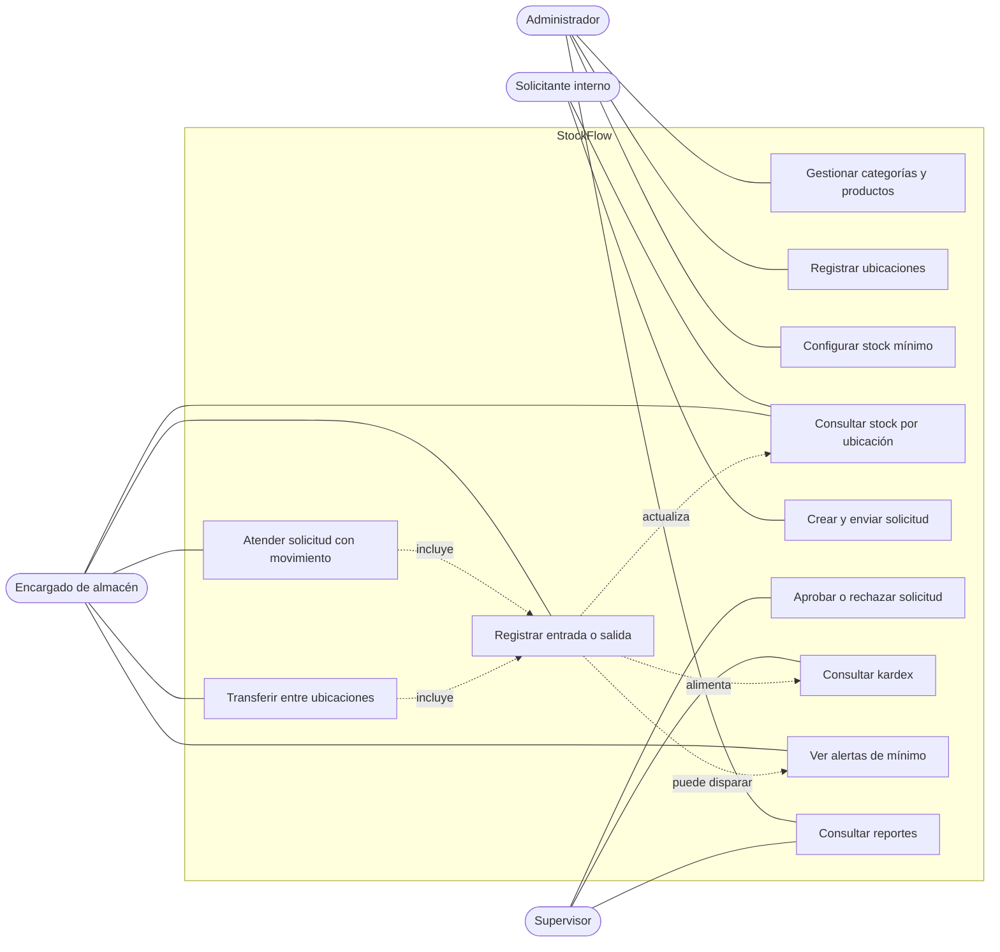
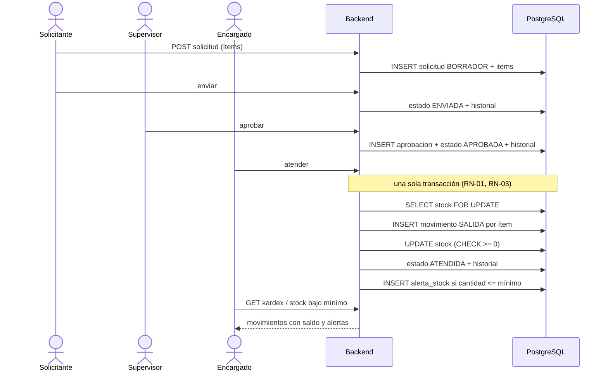

# Mapa de historias y casos de uso — StockFlow (PA-06)

**Versión:** 0.1 · **Base:** `backlog-v0.1.md` y ficha PA-06 (secciones C, D, J).

El mapa ordena las historias según el **recorrido del flujo crítico** (de izquierda a derecha) y por **prioridad** (de arriba hacia abajo). La primera fila es el "esqueleto andante": lo mínimo para recorrer el flujo de punta a punta.

> Flujo crítico (ficha, sección J): **Solicitante crea solicitud → Supervisor aprueba → Almacén atiende mediante movimiento → Stock se actualiza → Kardex y alerta reflejan el resultado.**

## 1. Mapa de historias

| Actividad → | 1. Preparar catálogo | 2. Pedir | 3. Decidir | 4. Atender y mover stock | 5. Controlar |
|---|---|---|---|---|---|
| **Actor principal** | Administrador | Solicitante interno | Supervisor | Encargado de almacén | Administrador / Supervisor |
| **P0 — esqueleto** | P0-02 Productos ✅ · P0-03 Ubicaciones ✅ · P1-01 Categorías ✅ | P0-04 Crear solicitud · P0-05 Enviar | P0-06 Aprobar / rechazar | P0-07 Atender · P0-08 Stock transaccional · P0-09 Sin negativo · P0-10 Transferir | P0-11 Kardex ✅ · P1-03 Alertas (API ✅) |
| **P0 — transversal** | P0-01 Autenticación por rol · P0-12 Docker Compose (⚠️) | | | | |
| **P1** | P1-02 Mínimo por ubicación | P1-04 Ver stock antes de pedir · P1-05 Seguir mis solicitudes | P1-06 Aprobar desde el móvil · P1-09 Historial de decisiones | P1-07 Movimientos desde el móvil | P1-08 Reportes · P1-10 Mensajes y estados de UI |
| **P2** | P2-06 Stock negativo excepcional | P2-03 Notificaciones de estado | P2-05 Histórico por solicitante | P2-01 Escaneo QR · P2-07 Observaciones | P2-02 Resumen con IA · P2-04 Dashboard |

✅ = implementado en el backend al 2026-10-03. Sin marca = pendiente.

## 2. Casos de uso por actor

## 3. Secuencia del flujo crítico (objetivo de la Parte II)

Hoy esta secuencia está demostrada en SQL (`datagrip/03_verificacion_y_pruebas.sql`, sección 8). En el backend ya existen el inicio (catálogo y ubicaciones) y el final (kardex y alertas: `/api/inventario`). Faltan los casos de uso de solicitudes y movimientos.
