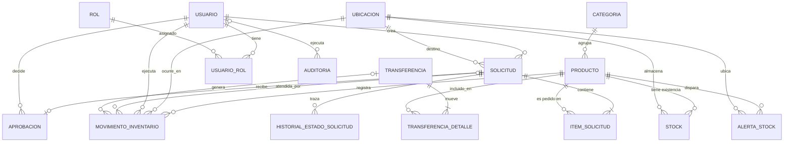

# DER lógico v0.1 — StockFlow (Clase 04)

## Convenciones
- PK = clave primaria · FK = clave foránea · UQ = unicidad · NN = obligatorio · CK = dominio

## categoria
PK categoria_id
NN codigo, nombre, activo
UQ codigo (global) · UQ nombre (global)

## producto
PK producto_id
FK categoria_id -> categoria.categoria_id (NN)
NN codigo, nombre, unidad_medida, stock_minimo_default
UQ codigo (global, RN-06)
CK unidad_medida ∈ {UNIDAD, CAJA, PAQUETE, KILOGRAMO, LITRO, METRO}
CK stock_minimo_default >= 0

## stock
PK stock_id · FK producto_id, ubicacion_id (NN)
UQ (producto_id, ubicacion_id) — unicidad **contextual/compuesta**
CK cantidad >= 0 (RN-03)

## movimiento_inventario
PK movimiento_id · FK producto_id, ubicacion_id, usuario_id (NN) · FK solicitud_id, transferencia_id (opc.)
CK tipo ∈ {ENTRADA, SALIDA, AJUSTE_POSITIVO, AJUSTE_NEGATIVO, TRANSFERENCIA_SALIDA, TRANSFERENCIA_ENTRADA}
CK cantidad > 0 (RN-02) · CK saldo_resultante >= 0 (RN-03)
CK referencia_tipo = 'SOLICITUD' ⇒ solicitud_id NOT NULL

## solicitud
PK solicitud_id · FK solicitante_id, ubicacion_destino_id (NN) · UQ codigo
CK estado ∈ {BORRADOR, ENVIADA, APROBADA, RECHAZADA, ATENDIDA, CANCELADA} (RN-05)

## Relaciones

1. **categoria 1 ---- N producto**
2. producto 1 ---- N stock · ubicacion 1 ---- N stock
3. producto/ubicacion/usuario 1 ---- N movimiento_inventario
4. solicitud 1 ---- N item_solicitud · solicitud 1 ---- 0..1 aprobacion
5. transferencia 1 ---- N transferencia_detalle

## Reglas que afectan el modelo
- RN-01: el stock no se edita solo → toda escritura pasa por movimiento_inventario en la misma transacción.
- RN-02: CK cantidad > 0 + NN usuario_id, ocurrido_at, referencia_tipo.
- RN-03: CK cantidad >= 0 en stock y saldo_resultante >= 0 en movimiento.
- RN-04: CK origen ≠ destino + dos movimientos en una transacción (backend).
- RN-05: CK de estado + tabla historial_estado_solicitud.
- RN-06: UQ producto.codigo.
- RN-07: stock.stock_minimo + tabla alerta_stock.
